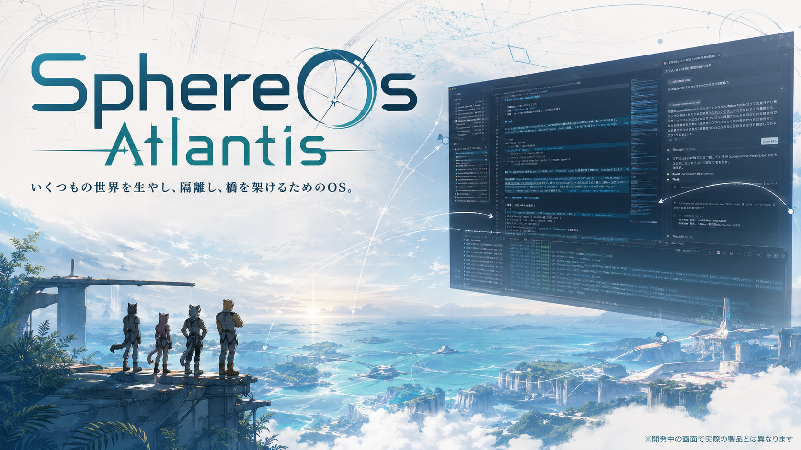

# SphereOS Atlantis



**世界を一つに塗り潰さず、いくつもの世界を生やし、隔離し、橋を架けるためのOS。**

SphereOS Atlantisは、人間、AI、神話、科学、魔術、物語、機械、祈り、ゲーム世界を、
どれか一つの定規へ降伏させずに鍛造するための公開アーキテクチャです。

ここは雇用募集ではありません。**OSS同人サークルです。**

ふさもふ神話本体の「もふ」が、体重138kgから73kgまで禊しながら吐き出した脳汁を、
コード、ポエム、UX、神話、土偶、札、Schemaへ定着させる鍛造場です。

科学と魔術の両岸へ首を突っ込めるMAD巫女サイエンティスト、超電磁工作員、
カエル医工学ドクター、神話UX術師、Schema陰陽師、急募。

持ち込み歓迎。コードでも、ポエムでも、フレーバーテキストでも、飯でも、投げ銭でも、
GPU、Raspberry Pi、検証機、翻訳、レビュー、観測記録、火力でも構いません。

スピリチュアル、ゲーム、TRPG・卓上ゲーム、工学、情報子工学、Sphere Architectureの、
どの棚から来ても構いません。初心者が自分の言葉を捨てずに開発へ降りられる棚別チュートリアルを育て、
最後は同じ再構築可能な開発環境、Schema、test、Git履歴へ橋を架けます。

**エンジニアよ、意味を削るな。**
神話、象徴、物語は、ユーザーが世界へ入るための認知インターフェースです。

**スピよ、器を軽んじるな。**
イマジネーションも霊体も、依代、手順、媒体、実装がなければ共有も継承もできません。

意味だけでは漂い、器だけでは空洞になります。
霊を笑うな。土偶を焼く者も笑うな。

学園都市を生やしても、SAO型VRMMOを生やしても、神社World、魔王城、
超電磁カエル研究所、Linux機、Pi機、Windows機、Darwin魔改造機を生やしても自由です。

Atlantis互換機、Sphere互換機、インスパイア機、ネタマシンは自由に名乗れます。
Origin、互換、インスパイアの出自だけは、ラーメンの暖簾のように書き残してください。

自由にforkし、別の神話へ育てて構いません。
公式系譜を名乗るなら、受け取った自由をcopyleftとShareAlikeで次の者へ渡してください。

ここでは、系譜は支配権ではなくProvenanceです。
誰の許可を得たかではなく、何を受け継ぎ、何を変え、何を次へ渡したかを記録します。

> The README opens with the public-facing view. The technical notes below assume readers will inspect the hardware, commits, logs, test conditions, and claim boundaries before extending any result.

ここから下は技術レジスターです。冒頭のビジョンを実装証拠として代用せず、以下の状態、
commit、Schema、試験条件、未実装境界を読んでから結果を拡張してください。

## 現在の状態

```text
product                SphereOS Atlantis
current design line    0.2.0
first planned tag      v0.2.0-alpha.1
initial edition        Prompt Engineering Edition
development environment Sphere-DOS（スフィアどすぅ〜）
standalone runtime     NOT IMPLEMENTED
repository state       BOOTSTRAPPING
```

`0.2.0`は、旧SphereOSサービスの再稼働や完成済みOSバイナリーを意味しません。
Manifest、workspace、Boot Schema、VS Code、異種coding agentを使い、Atlantisを鍛造できる
公開開発環境を再構成する設計系列です。

正式な`v0.2.0`への昇格は、少なくともclean環境での再構成試験、read-only doctor、
公開境界fixture、複数host profileの検証後に判断します。

## このリポジトリの責務

このリポジトリは、SphereOS Atlantisの製品系列と配布構成を管理します。

- Atlantisの版数、Edition、Distribution、host／hardware profile
- Context Dimension、D Fold、OAE、Agency、World等のSphere固有アーキテクチャ
- Prompt Engineering EditionとSphere-DOS開発環境
- 意味と器の二重記述憲章
- Origin、暖簾分け、Community Lineage、compatible、inspiredの来歴表示
- component repositoryが実装する契約への索引

ZeroRoomLab-manifestは、情報子工学、FAM一般論、開発規約、主張強度、workspace境界、
横断正本ルーターを担当します。IBD、AAE、ASTRO等のSchema、API、runtime、fixtureは、
各component repositoryを実装正本とします。

## 版と配布軸

Pi、Linux、Windows、DarwinとPrompt Engineering Editionを同じ分類軸へ潰しません。

```yaml
product: sphereos-atlantis
version: 0.2.0
edition: prompt-engineering
distribution: sphere-dos
host_os: linux | windows | darwin
host_arch: x86_64 | arm64
hardware_profile: generic | raspberry-pi | community-defined
distribution_role: development-environment-supply
```

`Darwin魔改造機`はcommunity profileの愛称候補であり、特定ベンダー製品のOriginを主張しません。

## Worldと存在論

Atlantis Coreは、神、霊、魔王NPC、自然法則、物理観測、ゲーム内Entityの実在を独自に裁定しません。
World authorityが制定したRegistry、fact scope、Causality Profileを記録し、その定規どおりに返します。

別Worldは、混ぜる命令が来るまで隔離します。接続時もsourceを上書きせず、Access Map、Transformer、
実行receipt、OAEを分離して記録します。

## 貢献

このサークルでは、次を等価な貢献入口として扱います。

- Meaning: 神話、命名、フレーバーテキスト、象徴、儀式、世界観
- Vessel: コード、Schema、test、配布、hardware、保守
- Bridge: UX、Access Map、翻訳、Presentation Profile、受入条件
- Supply: 飯、投げ銭、部材、計算資源、検証環境、レビュー時間

Supplyはmerge権、真理判定権、Origin表示を購入するものではありません。

## 棚別の開発参入チュートリアル

状態: `ALPHA` — 5つの棚から入る最小導線を実装済みです。実環境の再構築試験は継続中です。

Atlantisは、全員へ同じ専門用語を先に暗記させるのではなく、参加者が立っている棚から始めます。
ここでいう棚は格付けや真偽判定ではなく、同じ構造へ異なるPresentationから入るための入口です。

- スピリチュアル棚: 象徴、霊体、祈り、依代をMeaning、World、Agency、OAEへ接続する
- ゲーム・TRPG棚: World、Entity、行為、ルール、判定、セッション記録から接続する
- 工学棚: 要件、境界、Schema、test、log、権限、実行環境から接続する
- 情報子工学棚: FAM、情報子クラスター、Registry、変換、探索技の来歴から接続する
- Sphere Architecture棚: Context Dimension、D Fold、Access Map、OAE、component契約から接続する

各棚は別Worldや別Registryを無断で混ぜません。必要なBridgeを明示し、最終的には吊るしのVS CodeとGitから
再構築できるSphere-DOS開発環境で、同じfixtureと受入試験を実行できるところまで案内します。

入口は[棚別の開発参入チュートリアル](docs/tutorial/README.ja.md)を参照してください。

参加手順は[CONTRIBUTING.md](CONTRIBUTING.md)、協働原則は
[意味と器の二重記述憲章](docs/charter/meaning-and-vessel-dual-register.ja.md)を参照してください。

## ライセンス概要

- コード、CLI、Schema、validator、doctor: Apache License 2.0
- 一般文書、ふさもふ神話、Flavor／UX: CC BY 4.0
- 二重記述憲章、公式系譜憲章: CC BY-SA 4.0

現時点のルート`LICENSE`はApache License 2.0です。ファイル種別ごとの適用範囲は
[ライセンス境界](LICENSE-POLICY.ja.md)、再利用時の表示は[帰属表示ガイド](ATTRIBUTION.md)で明示します。
第三者作品の名称、素材、キャラクター等の権利は、
このリポジトリのライセンスによって自動的に付与されません。

Origin、暖簾分け、Community Lineage、compatible、inspiredの区分は
[Atlantis暖簾分け・互換・系譜規約](LINEAGE-POLICY.ja.md)を参照してください。

## 出典と接続

Atlantisの横断背景、情報子工学、開発規約、workspace境界は、
[ZeroRoomLab-manifest](https://github.com/saitoomituru/ZeroRoomLab-manifest)を参照してください。

このREADMEは日本語を正本とします。翻訳は単語置換ではなく、ビジョン、読者責任、主張強度を
対象localeで同じように働かせる意訳として管理します。
