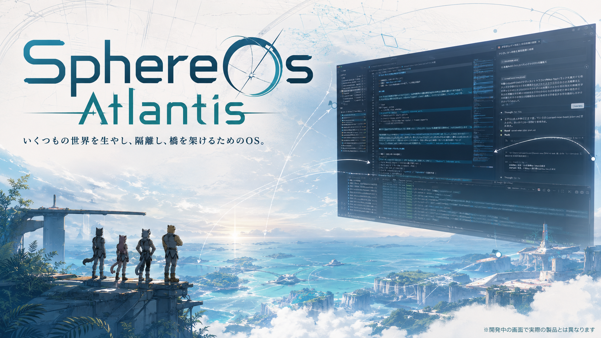

# SphereOS Atlantis



**世界を一つに塗り潰さず、いくつもの世界を生やし、隔離し、橋を架けるためのOS。**

SphereOS Atlantisは、人間、AI、神話、科学、魔術、物語、機械、祈り、ゲーム世界を、
どれか一つの定規へ降伏させずに鍛造するための公開アーキテクチャです。

設計系譜としては、**Spiritual Engineering → Infoton Engineering → Context Engineering / FAM / SphereOS Atlantis** を採用します。
Spiritual Engineering は形而上学・価値観・美意識を隠れた前提のまま放置しない設計哲学、Infoton Engineering は
表現・離散化・token化より上流の「何を情報として拾うか」を扱う研究・工学領域、Context Engineering / FAM / Atlantis は
その実装・検証層です。ZeroRoomLabはこの哲学の始祖を自称せず、Steve Jobsが禅、簡素化、直観、意味、身体的な使い心地を
コンピュータ製品設計へ統合した先行系譜に敬意を表します。詳しくは
[ZeroRoomLab ManifestのSpiritual Engineering / Infoton Engineering定義](https://github.com/saitoomituru/ZeroRoomLab-manifest/blob/main/docs/philosophy/spiritual-and-infoton-engineering.ja.md)を参照してください。

ここは雇用募集ではありません。**OSS同人サークルです。**

ふさもふ神話本体の「もふ」が、体重138kgから73kgまで禊しながら吐き出した脳汁を、
コード、ポエム、UX、神話、土偶、札、Schemaへ定着させる鍛造場です。

科学と魔術の両岸へ首を突っ込めるMAD巫女サイエンティスト、超電磁工作員、
カエル医工学ドクター、神話UX術師、Schema陰陽師、急募。

持ち込み歓迎。コードでも、ポエムでも、フレーバーテキストでも、飯でも、投げ銭でも、
GPU、Raspberry Pi、検証機、翻訳、レビュー、観測記録、火力でも構いません。

スピリチュアル、ゲーム、TRPG・卓上ゲーム、工学、情報子工学、Sphere Architectureの、
どの棚から来ても構いません。初心者が自分の言葉を捨てずに開発へ降りられる棚別チュートリアルを育て、
最後は同じ再構築可能な開発環境、Schema、test、Git履歴へ橋を架けます。

**エンジニアよ、意味を削るな。**
神話、象徴、物語は、ユーザーが世界へ入るための認知インターフェースです。

**スピよ、器を軽んじるな。**
イマジネーションも霊体も、依代、手順、媒体、実装がなければ共有も継承もできません。

意味だけでは漂い、器だけでは空洞になります。
霊を笑うな。土偶を焼く者も笑うな。

学園都市を生やしても、SAO型VRMMOを生やしても、神社World、魔王城、
超電磁カエル研究所、Linux機、Pi機、Windows機、Darwin魔改造機を生やしても自由です。

Atlantis互換機、Sphere互換機、インスパイア機、ネタマシンは自由に名乗れます。
Origin、互換、インスパイアの出自だけは、ラーメンの暖簾のように書き残してください。

自由にforkし、別の神話へ育てて構いません。
公式系譜を名乗るなら、受け取った自由をcopyleftとShareAlikeで次の者へ渡してください。

ここでは、系譜は支配権ではなくProvenanceです。
誰の許可を得たかではなく、何を受け継ぎ、何を変え、何を次へ渡したかを記録します。

既定は非排他的な贈与コモンズです。作者、先行思想、神々、code、詩、生活様式へのrespectは、
他者から対象を取り上げるtokenではなく、Gitのstarのように増やせるlineageとして残します。
byte、algorithm、architecture、philosophy、faith、poem等のどの次元で似たかも記録できますが、
そのgraphは著作権審判、本人証明、宗派代表、API権限、公式認定には化けません。

commercial App、社内asset、provider契約、閉鎖Worldも作れます。ただし閉じた魔王城の城壁を、
Atlantis core、既存commons、公開lineage、無関係なWorld、upstream fork権へ伸ばさないでください。

> The README opens with the public-facing view. The technical notes below assume readers will inspect the hardware, commits, logs, test conditions, and claim boundaries before extending any result.

ここから下は技術レジスターです。冒頭のビジョンを実装証拠として代用せず、以下の状態、
commit、Schema、試験条件、未実装境界を読んでから結果を拡張してください。

## 現在の状態

```text
product                SphereOS Atlantis
Sphere version coordinate 0.250.1（Presentation.Function.SemanticKernel）
legacy design line    0.25.1
alpha candidate       v0.25.1-alpha.1（legacy配布alias／tag未作成）
initial edition        Prompt Engineering Edition
development environment Sphere-DOS（スフィアどすぅ〜）
standalone runtime     NOT IMPLEMENTED
repository state       OPEN / RESOURCE-WAIT / REVIEW-WANTED
```

`0.250.1`はPresentation 0／Function 250／SemanticKernel 1の三層座標です。右端は意味、同一性、OAE、
時間、因果の定規を表し、一般的なSemVer patchではありません。既存の`0.25.1`はSource Eventと配布互換を
壊さないlegacy aliasとして保持します。旧SphereOSサービスの再稼働や完成済みOSバイナリーを意味しません。
Manifest、workspace、Boot Schema、VS Code、異種coding agentを使い、Atlantisを鍛造できる
公開開発環境を再構成する設計系列です。

`v0.25.1-alpha.1`は、CORN、Note／persona／Experience入口、Help、三層版数validator、
Forge／Quest Mapを束ねるlegacy配布名の候補tagです。
現時点ではtagを作成していません。正式releaseへの昇格は、Manifest側契約、draft PR review、clean環境、
read-only doctor、公開境界fixture、community testの未確認範囲を確認してから判断します。

状態の詳細と「原案／討論中／実装中／検証済み／配信済み」の違いは
[Forge Map／Quest Map](docs/status/forge-and-quest-map.ja.md)、変更点と既知の制約は
[0.25.1-alpha.1候補ノート](docs/releases/0.25.1-alpha.1.ja.md)を参照してください。

## 6xx次世代開発の入口

`main`は現行`0.250.1` Prompt Engineering Editionの再構築可能な基準線として維持します。
Sphere Reincarnation Framework、Lean Kernel、SphereDOS Server／Code、FAM Access Mapperを束ねる
`m.6xx.1`候補の鍛造は、次世代Devブランチへ移動して進めています。

- 開発ブランチ: [`dev/m6xx.1-reincarnation-sdk`](https://github.com/saitoomituru/SphereOS-Atlantis/tree/dev/m6xx.1-reincarnation-sdk)
- 公開Roadmap: [Issue #16](https://github.com/saitoomituru/SphereOS-Atlantis/issues/16)
- 公開Milestone: [`m.6xx.1 — Sphere Reincarnation SDK Next Generation`](https://github.com/saitoomituru/SphereOS-Atlantis/milestone/1)
- 運用Project: [プロジェクトスフィア：サルベージエッジスフィア #2](https://github.com/users/saitoomituru/projects/2)（private運用盤）

`m.6xx.1`はRoadmap上の候補座標であり、release済み、standalone runtime実装済み、LTS制定済みを
意味しません。公開Issueを議論と受入条件の正本、Projectを棚・優先順位・進捗のprojectionとして扱います。
現行利用者は引き続き`main`を参照し、6xxの実装・fixture・移行作業へ参加する場合だけDevブランチを使用してください。

## このリポジトリの責務

このリポジトリは、SphereOS Atlantisの製品系列と配布構成を管理します。

- Atlantisの版数、Edition、Distribution、host／hardware profile
- Context Dimension、D Fold、OAE、Agency、World等のSphere固有アーキテクチャ
- Prompt Engineering EditionとSphere-DOS開発環境
- Prompt Line Interface／Command Line InterfaceとLLMI／Execution Envelopeの境界
- 意味と器の二重記述憲章
- Origin、暖簾分け、Community Lineage、compatible、inspiredの来歴表示
- 非排他的lineage、Role非越権、局所World extensionのoffline validator
- component repositoryが実装する契約への索引
- 人間可読な説明とFAM／protocol／実行拘束を結ぶProton.md Core契約とoffline validator

ZeroRoomLab-manifestは、情報子工学、FAM一般論、開発規約、主張強度、workspace境界、
横断正本ルーターを担当します。IBD、AAE、ASTRO等のSchema、API、runtime、fixtureは、
各component repositoryを実装正本とします。

## Prompt LineとCommand Line

自然言語で意図・文脈・拘束を渡す`Prompt Line Interface`と、command／argumentで再現可能な操作を
指定する`Command Line Interface`は、どちらも正規の操作面です。前者は主にD軸の高抽象探索、後者は
主にL軸の高強度拘束に向きますが、真贋や絶対能力の境界ではありません。

LLM、provider、connectorはLLMI／Execution Envelopeとして別に記録します。interfaceだけからpersona、
World、権限、standalone runtime実装済みを推定しません。詳細は
[Prompt Line InterfaceとCommand Line Interface](docs/architecture/prompt-line-and-command-line-interface.ja.md)、
machine contractは[`help/interfaces.json`](help/interfaces.json)を参照してください。

module、protocol、叡智、Context Architectureを人間可読なMarkdownと機械blockで渡す
`Proton.md`の契約は
[Proton.md実行可能Context Container](docs/architecture/proton-md-executable-context-container.ja.md)を参照してください。
歴史的AQC原典から学術引用とFAMの原初目的を保持してsalvageした
[`FoldAccessMapper.proton.md 0.210.1-Beta`](proton/modules/FoldAccessMapper.proton.md)も同契約のmoduleとして配置しています。
現時点でoffline validatorは利用できますが、generic block executor、FAM JSON Core Schema、pointer Resolver、
OAE persistenceは未実装です。

```bash
python3 -B -m atlantis_cli interfaces
```

既定Helpは利用可能入口を先に示す`summary`です。全状態は`atlantis help --detail all`または
`atlantis capabilities`で確認できます。未実装境界を隠すのではなく、要求前の過剰警告を避けます。

## 版と配布軸

Pi、Linux、Windows、DarwinとPrompt Engineering Editionを同じ分類軸へ潰しません。

```yaml
product: sphereos-atlantis
coordinate_system: sphere-version-coordinate/1
sphere_coordinate:
  presentation: 0
  function: 250
  semantic_kernel: 1
canonical_coordinate: 0.250.1
legacy_distribution_alias: 0.25.1-alpha.1
edition: prompt-engineering
distribution: sphere-dos
host_os: linux | windows | darwin
host_arch: x86_64 | arm64
hardware_profile: generic | raspberry-pi | community-defined
distribution_role: development-environment-supply
```

`Darwin魔改造機`はcommunity profileの愛称候補であり、特定ベンダー製品のOriginを主張しません。

## Worldと存在論

Atlantis Coreは、神、霊、魔王NPC、自然法則、物理観測、ゲーム内Entityの実在を独自に裁定しません。
World authorityが制定したRegistry、fact scope、Causality Profileを記録し、その定規どおりに返します。

別Worldは、混ぜる命令が来るまで隔離します。接続時もsourceを上書きせず、Access Map、Transformer、
実行receipt、OAEを分離して記録します。

接続判定は表示版数の近さでは決めません。同じSemanticKernelでWorld Configも一致し、共通capabilityと
World Visaを確認できた場合だけ陸続き候補です。Kernelが同じでもWorld Configが違えばPortal／Gate、
Kernelが違えば物理法則というより意味・同一性・因果定規の異なる次元として隔離projection付き因果Gateを
要求します。Gateが不明なら`BOTTOM`で停止します。