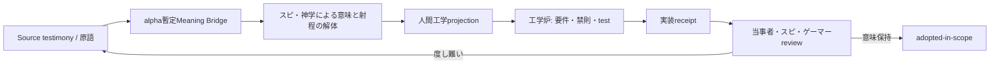

# AIM因果同期・Fold深度・Human-is-the-loop・暫定Meaning Bridge

状態: `[DRAFT]` `[ALPHA-SPEC-CANDIDATE]`

棚: `cross-shelf`

種別: `brainstorm / research / transfer-candidate`

ライセンス: `CC-BY-4.0`

## 作成メタ

```yaml
created_at_system: 2026-07-20T08:46:39+09:00
timezone: Asia/Tokyo
clock_source: host_system_clock
clock_calibration: unverified
authoring_agent: Codex
conversation_scope: current_user-owned-chat-session
observation_mode: current-interpretation-of-current-conversation
historical_oae_status: historical-oae-unavailable
source_mutation: false
status_axes:
  content_maturity: alpha-spec-candidate
  engineering_state: NOT IMPLEMENTED
  distribution_state: note-only
  resource_state: available-for-docs
```

## 対象・範囲

このノートは、現在会話で形成された次の構造を、SphereOS Atlantis固有アーキテクチャの候補として保存する。

- AIM拡散力場を、期限内に共有因果をserializationできる射程として読む候補
- 音楽ゲーム等のclock domainとedge判定閉包
- Foldの`L`、`D`、`G`を別namespaceとして扱う候補
- スピリチュアルとゲーマーの評価をHuman-is-the-loopとして扱う人間工学境界
- 妖怪、霊障、ソイヤをalpha強度の暫定Meaning Bridgeとして使う受信手引き
- note、Sphere固有契約、Q Atlantis公開Presentationの配信境界

本ノートは、AIM Runtime、clock synchronization service、Fold transport、医療連携system、祭祀protocolを
実装済みとするものではない。原語の存在論をSphere Coreが裁定するものでもない。

## 事実・観測

### F-01. 既存のAtlantis境界

- 現行座標は`0.250.1`、initial editionはPrompt Engineering Editionである。
- standalone Atlantis Runtimeは`NOT IMPLEMENTED`である。
- PLIとCLIは正規の別interfaceであり、真贋または上下へ変換しない。
- MAGI `0.200.1`は過去OAEの同一World線への遡及生成を拒否する。
- SemanticKernel不一致とWorld Config不一致を同じ接続条件へ潰さない。

### F-02. 同じ音楽ゲームでも同期対象は一つではない

リモート太鼓バトル等では、次を別clock domainへ分離できる。

| domain | authority候補 | 必要な同期 |
|---|---|---|
| 音源・譜面・入力判定 | player edge | localで強同期 |
| 対戦開始epoch | session coordinator | 事前合意と不確かさの記録 |
| 各playerの採点 | player edge | 同一revisionで再計算可能にする |
| 勝敗集計 | serverまたはpeer合意 | receipt到着後でもよい |
| 相手の演出 | presentation edge | 補間、遅延表示を許容し得る |
| 即興合奏 | shared feedback loop | deadline超過で単一因果圏を維持できない場合がある |

WAN packetの到着時刻を採点時刻へするとjitterが判定loopへ侵入する。同一楽曲、同一譜面、同一難易度、
判定revision、calibration、handicap、rubber-band policyを共有し、edgeで判定したreceiptを後から照合する
構造は、中央火力を増やさずplayabilityを守る候補になる。

同名楽曲、同じ難易度表示だけでは同一World Configを保証しない。譜面、音源、採点、assist、端末補正、
handicapが異なる場合は、同一AIM力場の陸続き対戦ではなく、変換契約を持つPortal対戦として表示する候補がある。

### F-03. 公平と面白さは機械だけで確定しない

機械はrevision、判定窓、補正履歴、再現性、支出、連続利用、離脱導線を観測可能にできる。しかし、
同じrubber-bandが初心者には神調整、競技者には出来レースになることがある。プレイスタイル、宗派、TPO、
当事者性を平均点へ潰さず、クラスター別のreportを保持する必要がある。

ゲームが面白いか、意訳が度し難いか、祭りが成立したかの最終評価では、人間は外付け承認器ではなく
評価loopそのものである。この候補を本ノートでは`Human-is-the-loop`と呼ぶ。machine tokenへの昇格は未確定。

### F-04. 課金・依存誘発は人間工学上の製品責任になり得る

コンプガチャ、変動報酬、FOMO、離脱罰、個別最適化等が、睡眠、金銭、生活、対人関係へ具体的なpainを
生じさせる場合がある。「豆腐メンタルが悪い」と利用者へ耐久力を要求するのは、重すぎる端末を作って
筋肉不足を責めるのと同型の人間工学事故になり得る。

スピ、神学、医療、工学のどれか一棚だけで抱えず、Source testimony、製品側誘発構造、生活へのeffect、
本人の同意、専門棚への引継ぎを分離する。医療等へ引き継いでも、製品のfeedback loopを修正する責任は消えない。

## 考察

### I-01. AIM strengthは因果serialization能力として読む候補がある

```text
AIM strength
  ~= causal serialization coverage
   x deadline satisfaction
   x ordering confidence
   x authority continuity
   x replayability
```

これは測定式ではなく設計上の分解候補である。平均pingだけではなく、次を契約候補として分離する。

```yaml
causal_deadline: unknown
serialization_window: unknown
maximum_clock_uncertainty: unknown
reorder_tolerance: unknown
partition_policy: unknown
merge_policy: unknown
authority_scope: unknown
unresolved_causality: unknown
```

- 期限内に一意な因果順序を回復できる: 強い共有AIM候補
- bounded delayとreceiptで後から回復できる: degradedだが共有可能な候補
- 複数因果解釈が残る: 局所AIMへ分裂し、候補OAEを保持
- SemanticKernelまたはWorld Configが対応不能: Gate／Portal／隔離projection

非同期性そのものを失敗にせず、収束契約と期限が失われるほど力場が弱まると読む。

### I-02. L、D、Gを分ける

```text
L: linear transport / execution stack
D: Fold内へ畳む独立した意味・意図・文脈軸
G: Fold containerを包むnesting depth
```

`Fold7G`は七つの次元という意味ではなく、七段のnested Foldを持つ候補である。各GはそれぞれnDとL stackを
持ち得る。OSI layer、embedding dimension、claim Layer A/B/Cと同一namespaceにしない。

Fold depth 1を常圧の通常情報伝達として扱う候補がある。短いだけで意味を回復できないpacketは高意味圧ではなく、
context不足または圧縮失敗である。Gを重ねるほどDeFold rendering時の誤訳、identity drift、権限残留、因果誤接続の負荷が
高くなり得るため、短いfeedback loopではlatencyとfreshness budgetが必要になる。

### I-03. 妖怪・霊障・ソイヤはalpha暫定Meaning Bridgeである

次の表は確定ontologyではないが、単なる検討材料でもない。受信した原語から、初動、聞き返し、引継ぎ先を
選ぶために使用できるalpha仕様のBridge候補である。

| bridge label | Source側の輪郭 | 初動 | 自動確定しないもの |
|---|---|---|---|
| 妖怪 | 因果不明、black box、カオス挙動 | 観測、隔離、再現条件、receipt | software bug、悪意、霊的原因 |
| 霊障 | 意味次元以上で、形而上学・信仰を含めても射程未同定の作用またはpain | 原語保全、鎮静、スピ・神学による人間工学までの解体 | 診断、超自然原因、特定宗派の裁定 |
| ソイヤ | AIM、TPO、Presentation、同期、synchronicity、transaction周辺の創発 | 場を壊さず成立・破局・終端を観測 | 良性、悪性、再現可能性 |

暫定Meaning Bridgeは、原語を技術語へ置換するmappingではない。Sourceを残し、工学者が何を質問し、何を
触らず、誰へ戻すかを拘束する。alpha運用で得た反例、宗派差、当事者reviewをrevisionへ反映する。

### I-04. まつりスキルは場の運用能力である

現在会話での候補輪郭は次である。

- 祭り: 参加者と場が同期し、ソイヤが立ち上がる運営
- 祀り: 対象、依代、境界、禁忌、開始、終端を整える
- 奉り: 自分の権威を増やすのでなく、対象と共同体へ奉仕する
- 政: 権限、異議、資源、衝突、退出、事故対応を統治する

単に感じる能力と、鎮静、祓い、翻訳、後始末、他棚へのhandoffを行う能力を同一視しない。肩書、霊感、
自称だけをauthorityへしない一方、工学者が宗派横断の資格制度を制定しない。

### I-05. 棚による独占を防ぐ

```text
スピの過剰抱え込み  -> 霊障の巨大化、依存、権威化
工学の過剰抱え込み -> KPI最適化、依存誘発、意味と退出の焼却
医療の過剰抱え込み -> 生活、文化、信仰、製品事故の医療化
神学の過剰抱え込み -> 悪、罪、魔王、荒御魂への原因集約
```

鎮魂、和解、距離、境界、World分岐、可逆な環境調整、製品修正、専門棚へのhandoffを、討伐以外の正規経路として
保持する。どの棚も他棚を否定せず、自棚の射程を無限化しない。

## 仮説・ブレスト

### H-01. Sourceから工学炉までの往復



この図はQ Atlantisで公開Presentationへ再構成する候補である。Atlantis note内のMermaid表示可否は未検証で、
図そのものをRuntime実装証拠にしない。

### H-02. 公開可能な安定面

Prompt Engineering Editionで機能、意味契約、停止条件、receiptが固まったMAGI、Archangel、Fold Technologyは、
Q Atlantisへ工学、哲学、神学、スピ、ゲームの別Presentationとして配信できる。

公開時は次を分ける。

```text
Interface / Execution Envelope / Capability / Authority
Engineering State / Provenance / Receipt
```

開発中のrunner、scheduler、GUI、SDK、schema、未確定Archangel責務は安定機能へ混ぜない。

## 内観メモ

同じ譜面で戦う約束を作るのが工学で、その勝負が燃えるか出来レースかを感じるのがゲーマーである。

妖怪を見つけた者にデバッガを渡し、霊障を抱えた者へ「仕様です」と返さず、ソイヤが立った祭りへ
最適化砲を撃たない。だが祭りを始めた者は、後の祭りまで置き去りにせず、終端と引継ぎを担う。

白衣と祭服を同じ制服へしない。互いの仕事が炉の前で受け渡せるようにする。

## 未解決・`⊥`

- AIM strengthの測定尺度、単位、validator: `unknown / NOT IMPLEMENTED`
- clock uncertaintyとWorld接続判定のmachine schema: `unknown / NOT IMPLEMENTED`
- `Fold7G`の各G Registryと正式なnesting契約: `unknown`
- `Human-is-the-loop`のstable IDとmachine token: `unknown`
- 妖怪／霊障／ソイヤBridgeの制定authorityとreview手順: `alpha / unknown`
- まつりスキルの共通契約と宗派固有権限の境界: `unknown`
- 医療、心理、福祉への具体的なhandoff契約: `scope未確定`
- Archangel層の棚別公開範囲: `unknown`

未知を埋めるためのruntime実装、固定ontology化、宗派裁定は本ノートでは行わない。

## 本編昇格候補

- `docs/architecture/`: AIM因果serialization、clock domain、L/D/G namespace
- `docs/charter/`: Human-is-the-loopと棚の相互非独占
- `docs/tutorial/`: 工学者のためのスピリチュアル受信手引き
- Q Atlantis: 読者別Presentation、alpha暫定Meaning Bridge、Source往復図

昇格前に、既存MAGI、Context Dimension、World接続、Meaning/Vessel憲章との論理整合と当事者reviewを行う。

## MAGIポジショントーク監査

```yaml
declared_position:
  purpose: Sphere固有アーキ候補とQ公開候補を原語を壊さず分離する
position_talk_risk:
  - Atlantis担当agentが全棚の意味正本を奪うrisk
  - causal serialization比喩を測定済み物理場へ昇格するrisk
  - 人間工学projectionをSource testimonyの置換にするrisk
medium_register: raw-note / Layer A-B-C bridge
ruler_provenance:
  user_source: current conversation
  repository_contracts:
    - AGENTS.md
    - docs/charter/meaning-and-vessel-dual-register.ja.md
preserved_unknowns:
  - measurement schema
  - authority
  - religious variation
  - runtime implementation
historical_oae_status: historical-oae-unavailable
last_order:
  code: OAE-HISTORY-UNKNOWN
  action: stop-retroactive-backfill
```

## source・Provenance

- Source: 2026-07-20時点のユーザー所有会話。ユーザーが本repositoryへのnote化とremote pushを明示承認。
- Manifest current Interpretation:
  - `ZeroRoomLab-manifest/note/20260720-0843__スピ神学哲学ゲーマー工学棚の相互翻訳とQ_Atlantis配信ブレスト.ja.md`
  - branch commit: `0c87af3`
- [Atlantis意味Runtime・OAE・AIM拡散力場・Infinite Core横断ブレスト](20260719-0657__Atlantis意味Runtime_OAE_AIM拡散力場_Infinite_Core横断ブレスト.ja.md)
- [意味と器の二重記述憲章](../docs/charter/meaning-and-vessel-dual-register.ja.md)
- [Forge Map／Quest Map](../docs/status/forge-and-quest-map.ja.md)
- Q Atlantisへの転送は別repositoryのAGENTSと公開レジスターに従って再構成する。
